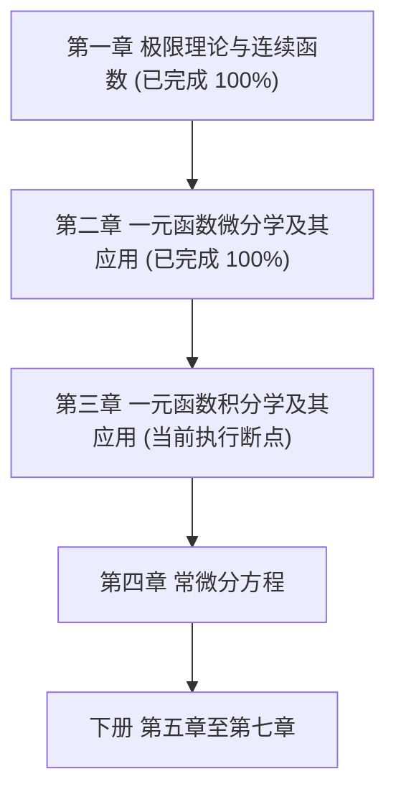
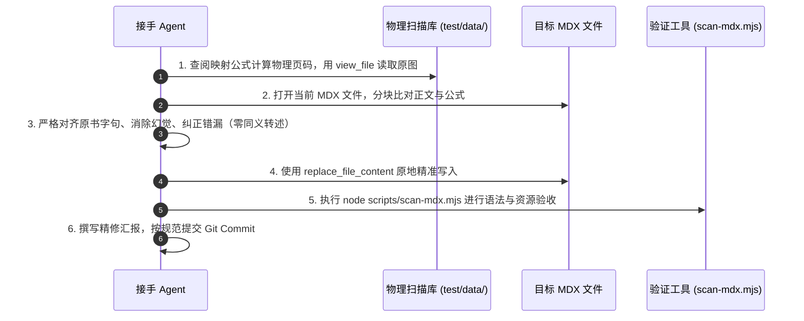

# 《工科数学分析基础》原书逐页精修改正与对齐交接文档

> [!IMPORTANT]
> **致接手本任务的 AI Agent**：
> 本项目当前正在进行全书级别的**“逐页原书比对与正文精修改正工程”**。
> 本书是高等工科院校经典国家级规划教材《工科数学分析基础》（高等教育出版社，马知恩、王绵森主编）。由于早期 OCR（如 MinerU 等工具）在处理密集数学公式、双栏边注与跨页排版时存在大量系统性缺陷（包括大段漏页、公式畸变、上下标错位、掉字漏字、同义转述幻觉等），当前核心任务是：**以原书纸质扫描件为唯一绝对真实源（Ground Truth），逐节逐页比照原书，重新精修改正一遍全部正文与公式表述，彻底消灭一切与原书出入之处！**
> 
> **最高原则**：**原书原文与正文必须 100% 完全吻合；严禁任何同义转述、自由发挥或凭空捏造的内容；严禁擅自删减或简化原书推导过程。**

---

## 1. 书籍基本档案与数据路径

### 1.1 书籍元数据

| 属性 | 详细规格 / 路径 |
| :--- | :--- |
| **书名** | 《工科数学分析基础》（第三版 / 第四版） |
| **编著者** | 马知恩、王绵森 主编（西安交通大学） |
| **出版单位** | 高等教育出版社 |
| **课程地位** | 面向 21 世纪课程教材 / “十二五”普通高等教育本科国家级规划教材 |
| **中央书库注册** | [src/config/collections.config.ts](file:///d:/Antigravity/project/AstroLib/src/config/collections.config.ts) (`engineering-analysis`) |
| **合集分类** | `math`（工科数学分析本科教材） |
| **路由 Slug** | `engineering_analysis` |
| **入口页面** | `00_内容说明.mdx` |
| **正文 MDX 目录** | `src/content/docs/collections/math/engineering_analysis/` |
| **插图资产目录** | `src/content/docs/collections/math/engineering_analysis/images/` |
| **原书 PDF 存储** | `test/data/工科数学分析基础 上册.pdf`<br>`test/data/工科数学分析基础 下册.pdf` |
| **高清扫描切片库** | `test/data/ch1_pages/` 至 `test/data/ch7_pages/`（**全部预先切片就绪，禁止重复切片**） |

---

## 2. 物理原图切片与核心映射公式（Ground Truth）

全书所有章节的高清扫描原图已提取完毕并按章分类归档，后续 Agent **无需调用脚本重新切片，直接调用 `view_file` 查看对应图片即可**。

### 2.1 上册核心映射公式（第一章至第四章）

上册扫描件前置包含 17 页非正文页（封一、扉页、版权页、出版说明、第三版前言、第一版前言、目录），正文印刷页码与物理切片图像编号遵循严格的**线性偏移公式**：

$$
\mathbf{PHYSICAL\_PAGE} = \mathbf{BOOK\_PAGE} + 17 \quad (\text{上册})
$$

即：
- 印刷页码 $P_{\text{book}} = 7$（第一章 起始页）$\longleftrightarrow$ 物理切片 `test/data/ch1_pages/phys_24.jpg`；
- 印刷页码 $P_{\text{book}} = 85$（第一章 结束页）$\longleftrightarrow$ 物理切片 `test/data/ch1_pages/phys_102.jpg`；
- 印刷页码 $P_{\text{book}} = 91$（第二章 起始页）$\longleftrightarrow$ 物理切片 `test/data/ch2_pages/phys_108.jpg`；
- 印刷页码 $P_{\text{book}} = 171$（第二章 结束页）$\longleftrightarrow$ 物理切片 `test/data/ch2_pages/phys_188.jpg`；
- 印刷页码 $P_{\text{book}} = 172$（第三章 起始页）$\longleftrightarrow$ 物理切片 `test/data/ch3_pages/phys_189.jpg`；
- 印刷页码 $P_{\text{book}} = 251$（第四章 起始页）$\longleftrightarrow$ 物理切片 `test/data/ch4_pages/phys_268.jpg`。

### 2.2 下册核心映射公式（第五章至第七章）

下册扫描切片存储于 `test/data/ch5_pages/`、`test/data/ch6_pages/`、`test/data/ch7_pages/`，页眉扫描结果索引参见 [test/data/headers_scan_result.txt](file:///d:/Antigravity/project/AstroLib/test/data/headers_scan_result.txt)。

---

## 3. 当前工程进度（第一章、第二章已 100% 验收）

截至当前，第一章《函数、极限、连续》（5 个章节文件）与第二章《一元函数微分学及其应用》（6 个章节文件）已严格比对原书扫描件并全量重写修正完毕，所有语法、KaTeX 数学公式与本地图片资产 100% 校验通过：

### 3.1 第一章验收记录

| 章节文件 | 原书对应范围 | 重构与修复核心战果 |
| :--- | :--- | :--- |
| `1.1_集合映射与函数.mdx` | Book 7~21 (Phys 24~38) | 纠正定义 1.3 值域“与它相对” $\to$ “与它对应”；接合跨图断裂句；修正“定义在上 A 上”、“定义区间”；纠正二维码“根本要素”；修正反函数语法。 |
| `1.2_数列的极限.mdx` | Book 24~41 (Phys 41~58) | **重大抢救**：完整补回此前因跨页遗漏的 **4 页核心内容**（例 2.7(2) 夹逼准则、例 2.8 证明与旁注、2.3 节单调有界准则定理 2.6 证明与几何插图 `fig_1_15.png`、例 2.9、例 2.10 与 $e$ 定义式、子数列归并原理）；修正刘徽古文“单位圆”与“无所失矣”；修正 Cauchy 收敛定理证明。 |
| `1.3_函数的极限.mdx` | Book 43~58 (Phys 60~75) | 清除全篇 34 处污染公式的 `<br />` 标签；完整补入定理 3.5 复合极限法则去心邻域重要约束条件评注；纠正例 3.9 单侧极限上标漏识（$\lim_{x \to 0^+}$）与连续性因式分解式。 |
| `1.4_无穷小量与无穷大量.mdx` | Book 60~68 (Phys 77~85) | 移除例 4.1 伪公式标签；**纠正致命数学错误**：将例 4.2 中 $1-\cos x$ 误写的“一阶无穷小”订正为原书结论“二阶无穷小”；修正“并非每个无穷小都有阶数”、“用加、减号相联结”。 |
| `1.5_连续函数.mdx` | Book 69~85 (Phys 86~102) | 规范全节各级标题层级（`## 5.1` $\sim$ `## *5.5`）；消除跨页断句；修正繁体字“它的一個间断点”；补回脱漏字“在证明函数零点**存在**的同时，还**给**出了零点的计算方法”；修正例 5.11(3) 错乱的复合极限嵌套分式；补齐定理 5.9 侧栏思考注记；统一全节数集符号为 $\mathbf{R}, \mathbf{N}_+$。 |

### 3.2 第二章验收记录

| 章节文件 | 原书对应范围 | 重构与修复核心战果 |
| :--- | :--- | :--- |
| `2.1_导数的概念.mdx` | Book 91~103 (Phys 108~120) | 彻底纠正多处 OCR 词汇漂移（如“瞬时流速”$\to$“瞬时流量”，“转角”$\to$“倾角”，“切线”$\to$“割线”）；补回定理 1.1 可导与连续证明中漏掉的因式分解推导与边注；补全例 1.6、例 1.7、例 1.12、例 1.13 等全部解答与侧栏“想一想”；统一数集符号 $\mathbf{R}$。 |
| `2.2_求导的基本法则.mdx` | Book 104~122 (Phys 121~139) | 补回反函数求导法则定理 2.3 的严格逆极限证明过程；规范 Leibniz 公式推导与数学归纳法步骤；修正例 2.11 隐函数二阶导数符号与代入推导；完整补齐相关变化率（仰角、水深流速）例题推导与几何关系解释；修正三角反函数定义域。 |
| `2.3_微分.mdx` | Book 123~129 (Phys 140~146) | 恢复微分概念几何推导（正方形面积增量分割）；修正线性主部与高阶无穷小定义；严格对齐一阶微分形式不变性评注；补齐高阶微分注意点；重构例 3.3、例 3.4 微分近似计算题解。 |
| `2.4_微分中值定理及其应用.mdx` | Book 130~144 (Phys 147~161) | 消除原 OCR 虚构的“思路分析”/“几何辅助函数”旁注，还原为原书正文；规范 Fermat、Rolle、Lagrange、Cauchy 中值定理卡片结构与几何辅助函数构造；严密对齐 L'Hospital 法则 7 种未定式证明与极限分类（$0/0, \infty/\infty, 0 \cdot \infty, \infty - \infty, 0^0, 1^\infty, \infty^0$）；补齐例 4.10 ~ 4.17 规范题解。 |
| `2.5_Taylor定理及其应用.mdx` | Book 144~153 (Phys 161~170) | **重大抢救**：补回被 OCR 遗漏的 `## 5.1 Taylor 定理` 整体小节导言；修正旁注“舍弃余项”、“一个小邻域”错字；恢复误差估计正文；完整订正 5 大经典 Maclaurin 展开式及常用推论；修正例 5.4 致命数学错误（将 $(x^2/2)^2$ 算错为 $x^4/4!$ 纠正为 $x^4/4$）；接合例 5.1 断裂解答；规范 `*例 5.2` 摄动法。 |
| `2.6_函数性态的研究.mdx` | Book 154~171 (Phys 171~188) | 恢复 `## 6.1 函数的单调性` 小节标题与引导段；补齐拐点在不可导点处的讨论与原书图示说明；修正“该曲线上一顶点”$\to$“该曲线上一点”；纠正光学 Fermat 原理“媒质”词汇；补齐例 6.7、例 6.8（Snell 折射定律推导）完整演算；对齐极值第一、第二充分条件定理与渐近线求解判定。 |

---

## 4. 常见 OCR 缺陷与错误类型检核库（踩坑指南）

接手 Agent 在审校后续章节时，必须高度警惕并重点排查以下 7 种系统性错误：

### 4.1 致命大段遗漏（Drop Pages / Proofs）
- **现象**：OCR 在遇到横线、栏目切换或跨页边界时，会莫名丢弃数页正文。
- **排查重点**：
  - 例题的“解”或“证明”是否突然被截断；
  - 准则、定理的几何证明与作图说明是否缺失；
  - 带有星号 `*` 的选学小节或深入讨论是否整段漏掉。

### 4.2 数学结论颠倒与逻辑致命伤
- **典型案例**：
  - 无穷小阶数错识（如“二阶”被识为“一阶”）；
  - 符号颠倒（如将 $\lim_{x \to 0^+}$ 识别为 $\lim_{x \to 0}$ 或漏掉上标）；
  - 变量下标漂移（如将 $\sin \frac{1}{x}$ 识别为 $\sin \frac{1}{x_1}$）；
  - 极限式分式嵌套错位（如将 $\lim_{\substack{t \to 0 \\ (x \to 0)}} \frac{t}{\ln(1+t)} \cdot \frac{\alpha\ln(1+x)}{x}$ 识别为多层乱码分数）。

### 4.3 边缘侧注与思考栏脱漏（SideNotes）
- 原书在版面外侧设计了大量的“想一想”、“注意”、“注”等边注。
- **规范**：必须使用 `<SideNote title="想一想">`、`<SideNote title="注意">`、`<SideNote title="注">` 完整呈现于对应定理或例题旁，严禁漏掉。

### 4.4 跨页与跨图断句、脱字错字
- 跨页处常常出现半句话被拆成两段，中间夹杂图片。必须将句子合并为通顺完整的学术段落；
- 存在严重漏字（如“在证明函数零点的同时，还出了...”漏掉了“存在”和“给”）；
- 印刷字词误识（如“编出简单的程序”错识为“输出简单的程序”）。

### 4.5 字体风格与数集符号不规范
- 原书印刷规范：数集（实数集、正整数集）与空间统一采用**学术加粗直体**：
  - 实数集：$\mathbf{R}$（禁止写作黑板粗体 $\mathbb{R}$）；
  - 正整数集：$\mathbf{N}_+$（禁止写作 $\mathbb{N}_+$）；
  - $n$ 维空间：$\mathbf{R}^n$。
- 向量统一使用斜体加粗符号（如 $\boldsymbol{\alpha}, \boldsymbol{x}$ 或 $\vec{a}$，与章节原书一致）。

### 4.6 标签污染与无效排版
- 清除行间公式前后多余的 `<br />`、`&nbsp;` 等垃圾标签；
- 统一中文全角标点符号（，。；：“”），公式内部使用半角符号与标准 LaTeX 宏。

### 4.7 繁体字残留
- 早期识别工具常夹带繁体字（如“它的一個间断点”），必须全部替换为简体字（“它的一个间断点”）。

---

## 5. 全书后续章节任务矩阵与物理切片索引

接手 Agent 请严格按以下顺序推进精修改正：



### 5.1 上册 第二章：一元函数微分学及其应用（已 100% 验收）

切片目录：`test/data/ch2_pages/`（`phys_108.jpg` 至 `phys_188.jpg`）

| 章节节次 | 对应 MDX 文件 | 原书页码 ($P_{\text{book}}$) | 物理切片文件名 ($P_{\text{phys}} = P_{\text{book}} + 17$) | 包含核心内容 |
| :--- | :--- | :--- | :--- | :--- |
| **2.1 导数的概念** | `2.1_导数的概念.mdx` | pp. 91 ~ 103 | `phys_108.jpg` ~ `phys_120.jpg` | 导数定义、单侧导数、几何意义、切线法线方程、可导与连续、变化率应用、习题 2.1 |
| **2.2 求导的基本法则** | `2.2_求导的基本法则.mdx` | pp. 104 ~ 122 | `phys_121.jpg` ~ `phys_139.jpg` | 四则运算求导、复合求导、反函数求导、高阶导数、Leibniz 公式、隐函数求导、参数方程求导、相关变化率、习题 2.2 |
| **2.3 微分** | `2.3_微分.mdx` | pp. 123 ~ 129 | `phys_140.jpg` ~ `phys_146.jpg` | 微分概念、线性主部、微分与导数关系、一阶微分形式不变性、高阶微分、近似计算、习题 2.3 |
| **2.4 微分中值定理及其应用** | `2.4_微分中值定理及其应用.mdx` | pp. 130 ~ 144 | `phys_147.jpg` ~ `phys_161.jpg` | Fermat 引理、Rolle 定理、Lagrange 中值定理、Cauchy 中值定理、L'Hospital 法则 7 种未定式、习题 2.4 |
| **2.5 Taylor定理及其应用** | `2.5_Taylor定理及其应用.mdx` | pp. 144 ~ 153 | `phys_161.jpg` ~ `phys_170.jpg` | 局部多项式逼近、带 Peano/Lagrange 余项的 Taylor 公式、Maclaurin 常用展开式、极限与近似计算、习题 2.5 |
| **2.6 函数性态的研究** | `2.6_函数性态的研究.mdx` | pp. 154 ~ 171 | `phys_171.jpg` ~ `phys_188.jpg` | 单调性判定、极值第一/第二充分条件、最大最小值求法、图像凹凸性与拐点、渐近线与函数作图、习题 2.6 |

---

### 5.2 上册 第三章：一元函数积分学及其应用（当前待推进）

切片目录：`test/data/ch3_pages/`（`phys_189.jpg` 起）

| 章节节次 | 对应 MDX 文件 | 原书页码 ($P_{\text{book}}$) | 包含核心内容 |
| :--- | :--- | :--- | :--- |
| **3.1 定积分概念存在条件与性质** | `3.1_定积分的概念存在条件与性质.mdx` | pp. 172 ~ 185 | 曲边梯形面积、定积分定义、Riemann 和、Darboux 上下和与可积充要条件、定积分 7 大性质、积分中值定理 |
| **3.2 微积分基本公式与基本定理** | `3.2_微积分基本公式与基本定理.mdx` | pp. 186 ~ 194 | 变上限积分函数、原函数存在定理、Newton-Leibniz 基本公式、不定积分概念与基本性质 |
| **3.3 两种基本积分法** | `3.3_两种基本积分法.mdx` | pp. 195 ~ 214 | 换元积分法（第一类凑微分、第二类变量代换）、分部积分法、有理函数积分法与部分分式分解 |
| **3.4 定积分的应用** | `3.4_定积分的应用.mdx` | pp. 215 ~ 238 | 微元法思想、平面图形面积、空间立体截面与旋转体体积、平面曲线弧长、物理功/压力/引力应用 |
| **3.5 反常积分** | `3.5_反常积分.mdx` | pp. 239 ~ 250 | 无穷限反常积分、瑕积分、收敛判定法（比较审敛法、Cauchy 主值） |

---

### 5.3 上册 第四章：常微分方程

切片目录：`test/data/ch4_pages/`

| 章节节次 | 对应 MDX 文件 | 原书页码 ($P_{\text{book}}$) | 包含核心内容 |
| :--- | :--- | :--- | :--- |
| **4.1 几类简单的微分方程** | `4.1_几类简单的微分方程.mdx` | pp. 251 ~ 273 | 微分方程概念与阶数、可分离变量方程、齐次方程、一阶线性微分方程、Bernoulli 方程、可降阶的高阶方程 |
| **4.2 高阶线性微分方程** | `4.2_高阶线性微分方程.mdx` | pp. 274 ~ 296 | 线性微分算子、解的叠加原理、Wronski 行列式与解的线性无关、常系数齐次线性方程特征根法、非齐次待定系数法与常数变易法 |
| **4.3 线性微分方程组** | `4.3_线性微分方程组.mdx` | pp. 297 ~ 305 | 一阶线性微分方程组矩阵形式、基解矩阵、常系数线性方程组特征向量求法 |

---

## 6. 标准作业流程（SOP：六步闭环法）

后续 Agent 开始精修某一章节时，必须严格执行以下六步：



### 具体实施细则：
1. **核准切片范围**：根据本交接文档第 5 节的表格，明确当前章节对应的起止物理页码（例如精修 2.1 节，需查看 `phys_108.jpg` 至 `phys_120.jpg`）。
2. **逐页精细对比**：切忌只看大意，必须对齐到每个公式的每一个上下标、每个定理的前提条件、每个例题的每一步演算。
3. **保护 AstroLib 语义卡片体系**：
   - 概念定义必须包裹在 `<Knowledge title="定义 X.X (...)">` 中；
   - 例题必须使用 `<Example title="例 X.X">`，解答使用 `<Solution title="解">` 或 `<Solution title="证">`；
   - 旁注思考使用 `<SideNote title="想一想 / 注意 / 注">`；
   - 课后练习触发器 `<ExerciseTrigger chapter={...} section="..." ... />` 置于文末。
4. **单次改动立即验证**：修改完一个 MDX 文件后，运行：
   ```bash
   node scripts/scan-mdx.mjs src/content/docs/collections/math/engineering_analysis
   ```
   确保 45/45 文件全部绿灯，无任何语法错误与死链。
5. **严禁调用多子代理**：根据项目纪律，正文校对工作由主智能体独立深度执行，避免因多智能体上下文割裂造成新的幻觉污染。

---

## 7. Git 提交与发布规范

所有代码提交必须遵循学术级约束（Academic Conventional Specification）：
- 格式：`fix(content): align <chapter/section> with printed textbook`
- 示例：
  - `fix(content): align section 2.1 with printed textbook`
  - `fix(content): restore dropped proofs and figures in chapter 2`
  - `docs(handover): add textbook proofreading and alignment guide for engineering analysis`
- 严禁中文 Commit，严禁 Emoji，严禁 AI 营销词汇。
