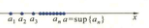

import ExerciseTrigger from '@/components/exercises/ExerciseTrigger.astro';
import QRCodeVideo from '@/components/QRCodeVideo.astro';

import Guide from '@/components/Guide.astro';
import Knowledge from '@/components/Knowledge.astro';
import Example from '@/components/Example.astro';
import Analysis from '@/components/Analysis.astro';
import Solution from '@/components/Solution.astro';
import Variant from '@/components/Variant.astro';
import Note from '@/components/Note.astro';
import SideNote from '@/components/SideNote.astro';
import Block from '@/components/Block.astro';
import Method from '@/components/Method.astro';
import Exercise from '@/components/Exercise.astro';

极限是深入研究变量变化规律的一个基本概念，是研究微积分的重要工具和思想方法。本节将着重介绍数列极限的概念、收敛数列的性质、判别数列收敛性的方法以及数列极限的求法，为进一步学习函数极限和微积分的其他知识打好基础。

### 2.1 数列极限的概念

在上节已经指出，数列可以看作定义在正整数集上的一个函数 $f: \mathbf{N}_+ \to \mathbf{R}$。换句话说，是对于每个 $n \in \mathbf{N}_+$，将所有对应的函数值 $a_n = f(n)$ 按照正整数的顺序排列出来的一列无尽的数：

$$

a_1, a_2, \cdots, a_n, \cdots

$$

记作 $\{a_n\}$。$a_n$ 称为该数列的通项，$n$ 为脚标。下面是五个不同数列的例子：

(1) $\left\{\frac{1}{n}\right\}$: $1, \frac{1}{2}, \frac{1}{3}, \cdots, \frac{1}{n}, \cdots$;

(2) $\left\{\frac{(-1)^n}{n}\right\}$: $-1, \frac{1}{2}, -\frac{1}{3}, \frac{1}{4}, \cdots, \frac{(-1)^n}{n}, \cdots$;

(3) $\left\{\frac{n-1}{n}\right\}$: $0, \frac{1}{2}, \frac{2}{3}, \frac{3}{4}, \cdots, \frac{n-1}{n}, \cdots$;

(4) $\{(-1)^{n-1}\}$: $1, -1, 1, -1, \cdots, (-1)^{n-1}, \cdots$;

(5) $\{2^n\}$: $2, 4, 8, \cdots, 2^n, \cdots$.

仔细观察不难发现，上述数列随着脚标 $n$ 的无限增大呈现出不同的变化状态：有的无限增大（如数列 (5)），有的没有确定的变化趋势（如数列 (4)），有的则无限接近于一个常数 $a$（如数列 (1), (2), (3)）。通常把随 $n$ 无限增大而无限接近于一个常数 $a$ 的数列叫做有极限的数列，$a$ 叫做该数列的极限，具有前两种变化状态的数列叫做没有极限的数列。例如，数列 (1) 和 (2) 当 $n$ 无限增大时它们都无限接近于 $0$，因而极限都是 $0$，数列 (3) 的极限是 $1$，数列 (4) 与 (5) 没有极限。这种朴素的极限思想早在我国古代就已经产生。三国时期魏国数学家刘徽（约公元 $225-295$ 年）用“割圆术”求圆周率 $\pi$，实际上就是将单位圆的面积看作它的各内接正多边形面积所构成的数列当边数无限增大时的极限。他提出的“割之弥细，所失弥小，割之又割以至不可割，则与圆合体而无所失矣”正是极限思想的萌芽。

<QRCodeVideo id="1.2.1" title="极限概念精确化的简要历程" url="#" />

<SideNote title="想一想">
极限的描述性定义有哪些缺陷？该定义中的两个“无限”（即“无限增大”和“无限接近”）应当怎样精确刻画？
</SideNote>

极限概念仅仅停留在朴素的描述性阶段是非常不够的。因为对上述的简单数列，容易通过直接观察看出它们的变化趋势并求出它们的极限。但是在许多理论和实际问题的研究中常常碰到一些数列，例如 $a_n = \left(1 + \frac{1}{n}\right)^n (n \in \mathbf{N}_+)$，用描述性定义仅靠直观难以判定它是否有极限, 求出它的极限值。在 Newton 和 Leibniz 发明微积分的时候, 人们对极限概念的认识还是模糊不清的, 以致对微积分中出现的许多问题不能给出合理的解释, 因而受到某些人的怀疑和攻击。经过众多数学家艰苦卓绝、百折不挠的努力, 直到 $19$ 世纪下半叶, 人们才给极限概念下了一个精确的数学定义, 使微积分成为一门严密的数学分支。下面我们从极限的描述性定义出发, 通过对具体例子的仔细分析逐步提炼出极限的精确定义。

在上述描述性的定义中, 我们都是用“无限增大”和“无限接近”来描述极限概念的。为了给极限一个精确的定义, 关键要给“无限增大”和“无限接近”以定量的刻画。

以数列 (2) 为例，虽然对于不同的 $n$，该数列的各项可以交替取得负值和正值，然而，随着 $n$ 的不断增大，它们与 $0$ 之差的绝对值 $\left|\frac{(-1)^n}{n} - 0\right| = \frac{1}{n}$（即数轴上点 $\frac{(-1)^n}{n}$ 与原点的距离）不断减小，而且可以任意小，要多小就可以多小，可以小于任意给定的正数。例如，要使它小于 $\frac{1}{10}$，只要 $n > 10$ 即可；要使它小于 $\frac{1}{10^5}$，只要 $n > 10^5$ 即可；……然而，仅用这些很小的具体数值是不能刻画 $\left|\frac{(-1)^n}{n} - 0\right|$ 可以任意小的。因为即便这个数取得再小，一旦具体确定下来，总会提出能否使 $\left|\frac{(-1)^n}{n} - 0\right|$ 更小的要求。例如 $\frac{1}{10^{10}}$，虽然当 $n > 10^{10}$ 时有 $\left|\frac{(-1)^n}{n} - 0\right| < \frac{1}{10^{10}}$，但不能保证 $\left|\frac{(-1)^n}{n} - 0\right| < \frac{1}{10^{11}}$。为了定量地刻画 $\left|\frac{(-1)^n}{n} - 0\right|$ 可以“任意小”“要多小就可以多小”，像在第一节上（下）确界定义中那样，应当引入任意给定的正数 $\varepsilon$。于是，上面那句话就可以表述为：对于任意给定的 $\varepsilon > 0$，无论它有多小，只要 $n$ 足够大，就可以使不等式 $\left|\frac{(-1)^n}{n} - 0\right| < \varepsilon$ 成立。这里，“足够大”的意思并不是要求该数列的所有项都满足这个不等式，只要 $n$ 充分大以后的所有项满足该不等式就行了。在上例中，对于任意给定的正数 $\varepsilon$，例如 $\varepsilon = \frac{1}{10}, \frac{1}{10^5}$，只要分别当 $n > 10, n > 10^5$ 时的所有各项都满足不等式 $\left|\frac{(-1)^n}{n} - 0\right| < \varepsilon$。一般地，为使 $\left|\frac{(-1)^n}{n} - 0\right| = \frac{1}{n} < \varepsilon$，只要 $n > \frac{1}{\varepsilon}$ 的所有各项都满足 $\left|\frac{(-1)^n}{n} - 0\right| < \varepsilon$。

将这个例子中的思想和表述方式抽象出来，就可得到数列极限的精确定义。

<Knowledge title="定义 2.1 (数列极限)">
设 $\{a_n\}$ 为一数列，若存在一个常数 $a \in \mathbf{R}$，对于任意给定的正数 $\varepsilon$，存在正整数 $N$，使得当 $n > N$ 时，恒有不等式

$$
|a_n - a| < \varepsilon \tag{2.1}
$$

成立，则称数列 $\{a_n\}$ 有极限，并称 $a$ 为它的极限，记作

$$
\lim_{n \to \infty} a_n = a \quad \text{或} \quad a_n \to a \quad (n \to \infty)
$$

</Knowledge>

<SideNote title="想一想">
(1) 有人说：“当 $n$ 充分大后，数列 $\{a_n\}$ 越来越接近于 $a$，则称 $\{a_n\}$ 的极限为 $a$。”这种说法对吗？为什么？
(2) 怎样用 $\varepsilon-N$ 语言表述 $\lim_{n \to \infty} a_n \neq a$。
</SideNote>

此时，也称 $\{a_n\}$ 为收敛数列。不收敛的数列称为发散数列。

数列极限的定义常用更简明的语言表述如下：若

$$
\forall \varepsilon > 0, \exists N \in \mathbf{N}_+, \text{使得} \forall n > N, \text{恒有} |a_n - a| < \varepsilon \tag{2.2}
$$

则称 $a$ 为数列 $\{a_n\}$ 的极限。

定义 2.1 称为数列极限的 $\varepsilon-N$ 定义。为了加深对它的理解，再作如下说明：

(1) 关于 “$\varepsilon$”。$\varepsilon$ 是任意给定的正数，可以任意小。详细点说，它具有两重性：任意性和给定性。给定之前可以任意，给定之后就是一个确定的常数。由于 $|a_n - a|$ 表示数轴上的对应点 $a_n$ 与 $a$ 之间距离，它的大小表示 $a_n$ 与 $a$ 的接近程度，因此，不等式 (2.1) 表示 $a_n$ 与 $a$ 可以任意接近，无限接近。

(2) 关于正整数 “$N$”。$N$ 是由给定的 $\varepsilon > 0$ 确定的保证不等式 (2.1) 成立的数列的脚标，它刻画了保证 (2.1) 成立所需要的 $n$ 变大的程度，$n > N$ 是保证 (2.1) 成立的条件. $N$ 仅与 $\varepsilon$ 有关，随 $\varepsilon$ 而变，常记成 $N(\varepsilon)$。但由于对给定的 $\varepsilon$，相应的 $N$ 不唯一，所以 $N$ 不是 $\varepsilon$ 的函数。

(3) 关于“恒有”。它表示数列 $\{a_n\}$ 中从第 $N$ 项以后的所有各项全部都满足不等式 (2.1)，不能只有无限项满足。

(4) 定义 2.1 只能用于验证 $a$ 是否是 $\{a_n\}$ 的极限，而不能用于求极限。用定义验证 $\{a_n\}$ 的极限是 $a$ 的关键在于设法由给定的 $\varepsilon > 0$，通过求解不等式 (2.1) 得到一个相应的 $N \in \mathbf{N}_+$，使 $n > N$ 时，该不等式恒成立。

<Example title="例 2.1">
用数列极限的定义证明 $\lim_{n \to \infty} \frac{n-1}{n} = 1$。
</Example>

<Solution title="证">
为了用定义验证这个结论，只要对任意给定的正数 $\varepsilon$，求出使不等式 (2.1) 成立的 $N$ 就够了。为此，任给 $\varepsilon > 0$，为使不等式

$$

\left|\frac{n-1}{n} - 1\right| = \frac{1}{n} < \varepsilon

$$

成立，只要 $n > \frac{1}{\varepsilon}$。取 $N = \left[\frac{1}{\varepsilon}\right]$①，则当 $n > N$ 时，就有 $\left|\frac{n-1}{n} - 1\right| < \varepsilon$。所以有 $\lim_{n \to \infty} \frac{n-1}{n} = 1$。
</Solution>

<QRCodeVideo id="1.2.2" title="数列极限的 $\varepsilon-N$ 定义中蕴含的科学思维法" url="#" />

<Example title="例 2.2">
设 $|q| < 1$，用定义证明 $\lim_{n \to \infty} q^n = 0$。
</Example>

<Solution title="证">
若 $q = 0$，结论显然成立。下面只需要证明 $0 < |q| < 1$ 时结论也成立。为此，任给 $\varepsilon > 0$（不妨设 $\varepsilon < 1$），为使 $|q^n - 0| = |q|^n < \varepsilon$，只需 $n \ln |q| < \ln \varepsilon$，即 $n > \frac{\ln \varepsilon}{\ln |q|}$（这里利用了 $\ln |q| < 0$）。取 $N = \left[\frac{\ln \varepsilon}{\ln |q|}\right]$，则当 $n > N$ 时，就有 $|q^n - 0| < \varepsilon$。由定义已知 $\lim_{n \to \infty} q^n = 0$（$|q| < 1$）。
</Solution>

<Example title="例 2.3">
用定义证明 $\lim_{n \to \infty} \frac{n}{3^n} = 0$。
</Example>

<Solution title="证">
只要对任给的 $\varepsilon > 0$（不妨设 $\varepsilon < 1$），求出 $N \in \mathbf{N}_+$，使得 $\forall n > N$，恒有

$$

\left|\frac{n}{3^n} - 0\right| = \frac{n}{3^n} < \varepsilon

$$

就行了。由于 $\frac{n}{3^n} < \frac{2^n}{3^n}$，由不等式 $\left(\frac{2}{3}\right)^n < \varepsilon$ 解得 $n > \frac{\ln \varepsilon}{\ln \frac{2}{3}}$。取 $N = \left[\frac{\ln \varepsilon}{\ln \frac{2}{3}}\right]$，则当 $n > N$ 时，就有 $\left|\frac{n}{3^n} - 0\right| < \left(\frac{2}{3}\right)^n < \varepsilon$，故 $\lim_{n \to \infty} \frac{n}{3^n} = 0$。
</Solution>

<SideNote title="注">
例 $2.3$ 中蕴含了一个用定义证明数列极限的重要思路。由于从不等式 $\left|\frac{n}{3^n} - 0\right| = \frac{n}{3^n} < \varepsilon$ 难以直接求得 $N$，注意到 $N$ 不是唯一的，也不必去求最小的 $N$，因此可将上述不等式左端适当放大，得到一个便于求 $N$ 的不等式。放大的方法可能很多，但应把握一个原则：放大后的数列通项仍可任意小。
</SideNote>

### 用邻域来定义数列极限

设 $x_0, \varepsilon \in \mathbf{R}, \varepsilon > 0$，称集合 $\{x \mid |x - x_0| < \varepsilon\}$（或 $\{x \mid x_0 - \varepsilon < x < x_0 + \varepsilon\}$）为 $x_0$ 的一个 $\varepsilon$ 邻域,简称 $x_0$ 的邻域,记作 $U(x_0, \varepsilon)$ 或 $U(x_0)$，即

$$

U(x_0, \varepsilon) = \{x \mid |x - x_0| < \varepsilon\} \quad \text{或} \quad U(x_0, \varepsilon) = \{x \mid x_0 - \varepsilon < x < x_0 + \varepsilon\}，

$$

称 $U(x_0, \varepsilon) \setminus \{x_0\}$ 为 $x_0$ 的一个去心 $\varepsilon$ 邻域,简称 $x_0$ 的去心邻域,记作 $\mathring{U}(x_0, \varepsilon)$ 或 $\mathring{U}(x_0)$。

有了邻域的概念，不等式 (2.1) 就可写成

$$

a - \varepsilon < a_n < a + \varepsilon \quad \text{或} \quad a_n \in U(a, \varepsilon)，

$$

因而数列极限就能用邻域定义如下：

$$

\forall \varepsilon > 0, \exists N \in \mathbf{N}_+, \text{使得} \forall n > N, \text{恒有} a_n \in U(a, \varepsilon) \tag{2.3}

$$

由于 $a$ 的 $\varepsilon$ 邻域就是数轴上以 $a$ 为中心的开区间 $(a-\varepsilon, a+\varepsilon)$，因此用邻域定义数列极限就具有明显的几何意义。事实上，数列 $\{a_n\}$ 对应数轴上就是一列点，以后也称数列为点列，仍记为 $\{a_n\}$。若 $\lim_{n \to \infty} a_n = a$，则由 (2.3) 式，对任给的 $\varepsilon > 0$，无论多么小，总能求得 $N \in \mathbf{N}_+$，该点列中从第 $N+1$ 个开始，后面的所有点全部落在开区间 $(a-\varepsilon, a+\varepsilon)$ 中，在这个开区间之外至多只有有限个点 $a_1, a_2, \cdots, a_N$（图 1.12）。由此得知：**数列收敛与否,若收敛其极限的大小都与它前面的有限项无关.改变数列中的有限项的值,不会改变其收敛性和极限值.**

<figure class="vp-figure">
  
  <figcaption>图 1.12 数列极限的几何意义示意图</figcaption>
</figure>

---

### 2.2 收敛数列的性质

如何判断给定数列是否收敛,若收敛,如何求出极限值,是数列极限理论中的两个基本问题.本段先讨论收敛数列的一些重要性质和极限的有理运算法则,它们对解决这两个基本问题都能提供一些有用的信息和方法.

根据数列极限的几何意义,若数列 $\{a_n\}$ 收敛于 $a$,则当 $n$ 充分大时,该数列在数轴上的对应点都聚集在 $a$ 的足够小的邻域内,因此它不可能再收敛于另一个与 $a$ 不同的数.于是我们就有

<Knowledge title="定理 2.1 (唯一性)">
收敛数列的极限是唯一的。
</Knowledge>

<Solution title="证明">
用反证法。设 $\lim_{n \to \infty} a_n = a, \lim_{n \to \infty} a_n = b$，不妨设 $a < b$，取 $\varepsilon_0 = \frac{b-a}{2}$。根据定义 2.1，由于 $\lim_{n \to \infty} a_n = a$，所以

$$

\exists N_1 \in \mathbf{N}_+, \text{使得} \forall n > N_1, \text{恒有} |a_n - a| < \varepsilon_0，

$$

从而当 $n > N_1$ 时，有（图 1.13）

$$

a - \varepsilon_0 < a_n < a + \varepsilon_0 = \frac{a+b}{2}。

$$

又由 $\lim_{n \to \infty} a_n = b$ 可知 $\exists N_2 \in \mathbf{N}_+$，当 $n > N_2$ 时，有

$$

\frac{a+b}{2} = b - \varepsilon_0 < a_n < b + \varepsilon_0。

$$

令 $N = \max\{N_1, N_2\}$，则当 $n > N$ 时，既有 $a_n < \frac{a+b}{2}$，又有 $a_n > \frac{a+b}{2}$。这是不可能的，因此必有 $a = b$。
</Solution>

<figure class="vp-figure">
  
  <figcaption>图 1.13 定理 2.1 唯一性证明几何示意图</figcaption>
</figure>

<SideNote title="注">
定理 2.1 的证明中取 $\varepsilon_0 = \frac{b-a}{2}$ 是为了保证 $a$ 的 $\varepsilon_0$ 邻域 $(a-\varepsilon_0, a+\varepsilon_0)$ 与 $b$ 的 $\varepsilon_0$ 邻域 $(b-\varepsilon_0, b+\varepsilon_0)$ 互不相交，实际上，比 $\frac{b-a}{2}$ 小的任何正数都可作为 $\varepsilon_0$。
</SideNote>

<SideNote title="想一想">
试用数列极限的几何意义简要说明定理 2.1 与定理 2.2 的证明思路。如何定义无界数列？
</SideNote>

仿照数集的有界性可以定义数列的有界性。设 $\{a_n\}$ 是一个数列，若

$$

\exists L \in \mathbf{R} \text{使得} \forall n \in \mathbf{N}_+, \text{恒有 } a_n \le L，

$$

则称 $\{a_n\}$ 有上界（或上有界），$L$ 称为它的一个上界.类似可定义数列 $\{a_n\}$ 有下界（或下有界）及下界。若 $\{a_n\}$ 既有上界也有下界，则称 $\{a_n\}$ 是有界数列。否则，称 $\{a_n\}$ 为无界数列。容易证明，$\{a_n\}$ 有界 $\iff \exists M > 0$，使得 $\forall n \in \mathbf{N}_+$ 恒有 $|a_n| \le M$。因此，数列有界在几何上就是对应的点列全部落在以原点为中心的闭区间 $[-M, M]$ 上。根据数列极限的几何意义，在收敛于 $a$ 的数列所对应的点列中除有限个点之外都落在以 $a$ 为中心的开区间 $(a-\varepsilon, a+\varepsilon)$ 中，而在区间之外的有限个数中总有一个绝对值最大的，由此不难证明：

<Knowledge title="定理 2.2 (有界性)">
收敛数列是有界的。
</Knowledge>

<Solution title="证">
设数列 $\{a_n\}$ 收敛，且 $\lim_{n \to \infty} a_n = a$。根据极限的定义，对于 $\varepsilon = 1$，$\exists N \in \mathbf{N}_+$，使得 $\forall n > N$，恒有 $|a_n - a| < 1$。从而，当 $n > N$ 时，

$$

|a_n| = |a_n - a + a| \le |a_n - a| + |a| < 1 + |a|。

$$

由于在数列 $\{a_n\}$ 的前 $N$ 项中总可选出绝对值最大的一项，因此只要令

$$

M = \max\{|a_1|, |a_2|, \cdots, |a_N|, |a| + 1\}，

$$

则 $\forall n \in \mathbf{N}_+$，都有 $|a_n| \le M$，故 $\{a_n\}$ 是有界数列。
</Solution>

定理 2.2 表明，有界性是数列收敛的必要条件。所以，若数列 $\{a_n\}$ 无界，则 $\{a_n\}$ 必定发散。例如，数列 $\{2^n\}$， $\left\{n \cos \frac{n\pi}{2}\right\}$ 无界，因而是发散的。但是，有界不是数列收敛的充分条件，就是说，有界数列不一定收敛。例如，数列 $\{(-1)^n\}$ 是有界的，却不收敛。

<Knowledge title="定理 2.3 (有理运算法则)">
设 $\lim_{n \to \infty} a_n = a, \lim_{n \to \infty} b_n = b$，则
(1) $\lim_{n \to \infty} (a_n \pm b_n) = \lim_{n \to \infty} a_n \pm \lim_{n \to \infty} b_n = a \pm b$;
(2) $\lim_{n \to \infty} a_n b_n = \lim_{n \to \infty} a_n \lim_{n \to \infty} b_n = ab$;
(3) $\lim_{n \to \infty} \frac{a_n}{b_n} = \frac{\lim_{n \to \infty} a_n}{\lim_{n \to \infty} b_n} = \frac{a}{b} \quad (b \neq 0)$。
</Knowledge>

<Solution title="证">
这些法则都不难用数列极限的定义证明，下面仅证法则 (2)，其余留给读者。$\forall \varepsilon > 0$，由 $\lim_{n \to \infty} a_n = a$，

$$

\exists N_1 \in \mathbf{N}_+ \text{使得} \forall n > N_1 \text{恒有 } |a_n - a| < \varepsilon。

$$

又由 $\lim_{n \to \infty} b_n = b$，

$$

\exists N_2 \in \mathbf{N}_+, \text{使得 } \forall n > N_2, \text{恒有 } |b_n - b| < \varepsilon。

$$

令 $N = \max\{N_1, N_2\}$，则 $\forall n > N$，恒有 $|a_n - a| < \varepsilon$，且 $|b_n - b| < \varepsilon$。再根据定理 2.2，数列 $\{b_n\}$ 有界，故 $\exists M > 0$，使得 $\forall n \in \mathbf{N}_+$，恒有 $|b_n| \le M$。于是，$\forall n > N$，

$$

\begin{aligned}
|a_n b_n - ab| &= |a_n b_n - b_n a + b_n a - ab| \\
&\le |b_n| |a_n - a| + |a| |b_n - b| \le (M + |a|) \varepsilon \tag{2.4}
\end{aligned}

$$

注意到 $(M + |a|) \varepsilon$ 仍是一个任意小的正数，故知结论成立。
</Solution>

<SideNote title="注意">
(1) 定理 2.3 体现了利用已知认识未知的思想，即通过已知一些简单数列的收敛性和极限值判断它们的和、差、积、商所得得到的比较复杂数列收敛性，并求其极限值。
(2) 在使用这些法则时，应要求参与运算的数列都收敛，对除法运算还应要求分母的极限不为零.否则，结论未必成立。
(3) 加减法与乘法法则可推广到有限个数列，但对无限个数列或通项是无限多项之和或乘积的数列未必成立。
</SideNote>

由法则 (2) 易得如下推论：设 $k$ 为常数，$m$ 为正整数，则 $\lim_{n \to \infty} ka_n = ka, \lim_{n \to \infty} (a_n)^m = a^m$。

<Example title="例 2.4">
求 $\lim_{n \to \infty} \frac{1^2 + 2^2 + \cdots + n^2}{n^3}$。
</Example>

<Solution title="解">
由于待求极限的数列可以看作是 $n$ 个数列 $\frac{1}{n^3}, \frac{2^2}{n^3}, \cdots, \frac{n^2}{n^3} = \frac{1}{n}$ 之和.当 $n \to \infty$ 时，它是无穷多个数列之和，所以不能直接利用有理运算法则 (1).对于这种情况，通常可先求出前 $n$ 个数列的和，再用定理 2.3 来求其极限.本例中，由已知公式可知

$$

\frac{1^2 + 2^2 + \cdots + n^2}{n^3} = \frac{n(n+1)(2n+1)}{6n^3} = \frac{1}{6}\left(1 + \frac{1}{n}\right)\left(2 + \frac{1}{n}\right)，

$$

从而易得

$$

\lim_{n \to \infty} \frac{1^2 + 2^2 + \cdots + n^2}{n^3} = \frac{1}{3}。

$$

</Solution>

<Example title="例 2.5">
求 $\lim_{n \to \infty} \frac{4n^5 + 3n^2 + 6n + 1}{3n^5 + 6n^4 + n^3 + 2n}$。
</Example>

<Solution title="解">
因为待求极限数列的分子与分母极限都不存在，所以不能利用极限的除法运算法则 (3)，但是，分子与分母同除以它们的最高次幂 $n^5$，得

$$

\frac{4n^5 + 3n^2 + 6n + 1}{3n^5 + 6n^4 + n^3 + 2n} = \frac{4 + \frac{3}{n^3} + \frac{6}{n^4} + \frac{1}{n^5}}{3 + \frac{6}{n} + \frac{1}{n^2} + \frac{2}{n^4}}，

$$

从而可利用有理运算法则得

$$

\lim_{n \to \infty} \frac{4n^5 + 3n^2 + 6n + 1}{3n^5 + 6n^4 + n^3 + 2n} = \frac{4}{3}。

$$

</Solution>

<Example title="例 2.6">
求 $\lim_{n \to \infty} \left[\frac{1}{1 \cdot 2} + \frac{1}{2 \cdot 3} + \cdots + \frac{1}{n(n+1)}\right]$。
</Example>

<Solution title="解">
由于待求极限数列的通项是 $n$ 项之和，当 $n \to \infty$ 时，就是无限多项之和，不能直接利用有理运算法则 (1).对于这种情况，可类似于例 2.4，先设法求出 $n$ 项之和，再用法则 (1).本例中，利用将每一项写成两项之差，可得

$$

\begin{aligned}
\frac{1}{1 \cdot 2} + \frac{1}{2 \cdot 3} + \cdots + \frac{1}{n(n+1)} &= \left(1 - \frac{1}{2}\right) + \left(\frac{1}{2} - \frac{1}{3}\right) + \cdots + \left(\frac{1}{n} - \frac{1}{n+1}\right) \\
&= 1 - \frac{1}{n+1}，
\end{aligned}

$$

从而由法则 (1) 得

$$

\lim_{n \to \infty} \left[\frac{1}{1 \cdot 2} + \frac{1}{2 \cdot 3} + \cdots + \frac{1}{n(n+1)}\right] = 1。

$$

</Solution>

<Knowledge title="定理 2.4 (保号性)">
设 $\lim_{n \to \infty} a_n = a, a \neq 0$，则 $\exists N \in \mathbf{N}_+$，使得 $\forall n > N$，$a_n$ 与 $a$ 同号。并且，若 $a > 0$（或 $a < 0$），则 $\exists N \in \mathbf{N}_+$，使得 $\forall n > N$，恒有 $a_n \ge q > 0$（或 $a_n \le q < 0$）。
</Knowledge>

<Solution title="证">
不妨设 $a > 0$，取 $\varepsilon = \frac{a}{2}$，则由 $\lim_{n \to \infty} a_n = a$ 知必 $\exists N \in \mathbf{N}_+$，使得 $\forall n > N$，恒有 $a_n \in U(a, \varepsilon) = (a-\varepsilon, a+\varepsilon) = \left(\frac{a}{2}, \frac{3}{2}a\right)$（图 1.14），故 $\forall n > N$，$a_n \ge \frac{a}{2} = q > 0$。
</Solution>

<figure class="vp-figure">
  
  <figcaption>图 1.14 保号性定理几何意义示意图</figcaption>
</figure>

<SideNote title="想一想">
定理 2.4 的证明中，为什么取 $\varepsilon = \frac{a}{2}$？$\varepsilon$ 可以取其他数吗？若 $\{a_n\}$ 收敛，且它的每一项 $a_n > 0$，试问其极限 $a > 0$ 吗？若 $\{b_n\}$ 都收敛，且 $a_n > b_n$，试问它们的极限 $a$ 与 $b$ 必有 $a > b$ 吗？试举例说明。
</SideNote>

由此定理并利用反证法不难证明

<Knowledge title="推论 2.1 (保序性)">
设 $\lim_{n \to \infty} a_n = a, \lim_{n \to \infty} b_n = b$.若 $\exists N \in \mathbf{N}_+$，使得 $\forall n > N$，恒有 $a_n \le b_n$，则 $a \le b$。
</Knowledge>

<Knowledge title="定理 2.5 (夹逼性)">
设 $\lim_{n \to \infty} a_n = \lim_{n \to \infty} b_n = a$.若 $\exists N \in \mathbf{N}_+$，使得 $\forall n > N$，恒有 $a_n \le c_n \le b_n$，则 $\lim_{n \to \infty} c_n = a$。
</Knowledge>

<Solution title="证">
由于 $\lim_{n \to \infty} a_n = \lim_{n \to \infty} b_n = a$，所以，$\forall \varepsilon > 0$，$3 \exists N \in \mathbf{N}_+$，使得 $\forall n > N$，恒有

$$

a - \varepsilon < a_n < a + \varepsilon \quad \text{且} \quad a - \varepsilon < b_n < a + \varepsilon，

$$

从而得到

$$

a - \varepsilon < a_n \le c_n \le b_n < a + \varepsilon。

$$

于是，$\forall n > N$，恒有 $|c_n - a| < \varepsilon$，故 $\lim_{n \to \infty} c_n = a$。
</Solution>

<SideNote title="想一想">
在定理 2.5 的证明中，为什么对于给定的 $\varepsilon > 0$，能得到同一个 $N$，当 $n > N$ 时使两个不同的数列 $\{a_n\}$ 与 $\{b_n\}$ 满足两个同样的不等式？
</SideNote>

夹逼性的优点在于它不但可用于证明数列 $\{c_n\}$ 的收敛性，而且还能同时求出它的极限，因此受到人们的钟爱.应用时常常需要对 $\{c_n\}$ 进行适当的放大和缩小，得到两个极限存在且相等的数列 $\{a_n\}$ 与 $\{b_n\}$，使它们满足（或从某一项开始满足）夹逼不等式 $a_n \le c_n \le b_n$.这是使用夹逼性的关键和困难所在。

<Example title="例 2.7">
证明：
(1) $\lim_{n \to \infty} \sqrt[m]{1 + \frac{1}{n^l}} = 1$，其中 $m, l \in \mathbf{N}_+$；
(2) $\lim_{n \to \infty} \left(\frac{1}{\sqrt{n^2+1}} + \frac{1}{\sqrt{n^2+2}} + \cdots + \frac{1}{\sqrt{n^2+n}}\right) = 1$。
</Example>

<Solution title="证">
(1) 由于 $1 < \sqrt[m]{1 + \frac{1}{n^l}} \leqslant 1 + \frac{1}{n^l}$，并且 $\lim_{n \to \infty} \left(1 + \frac{1}{n^l}\right) = 1$，故由夹逼性得知

$$
\lim_{n \to \infty} \sqrt[m]{1 + \frac{1}{n^l}} = 1.
$$

(2) 由于该数列的通项是 $n$ 项之和，并且难以直接求得该和，不能利用例 2.4 和例 2.6 中的方法，所以利用不等式放、缩技巧，易得

$$
\frac{n}{\sqrt{n^2+n}} \leqslant \frac{1}{\sqrt{n^2+1}} + \frac{1}{\sqrt{n^2+2}} + \cdots + \frac{1}{\sqrt{n^2+n}} \leqslant \frac{n}{\sqrt{n^2+1}},
$$

由 (1) 又有

$$
\lim_{n \to \infty} \frac{n}{\sqrt{n^2+n}} = \lim_{n \to \infty} \frac{1}{\sqrt{1 + \frac{1}{n}}} = 1,
$$

$$
\lim_{n \to \infty} \frac{n}{\sqrt{n^2+1}} = \lim_{n \to \infty} \frac{1}{\sqrt{1 + \frac{1}{n^2}}} = 1,
$$

根据夹逼性知结论成立。
</Solution>

<Example title="例 2.8">
证明 $\lim_{n \to \infty} \sqrt[n]{a} = 1 \ (a > 0)$。
</Example>

<Solution title="证">
当 $a = 1$ 时结论显然成立。对于 $a > 1$ 的情形，令 $\sqrt[n]{a} = 1 + x_n$，则 $x_n > 0$。由二项式公式，

$$
a = (1 + x_n)^n = 1 + n x_n + \frac{n(n-1)}{2!} x_n^2 + \cdots + x_n^n \geqslant 1 + n x_n,
$$

从而有 $x_n \leqslant \frac{a-1}{n}$，故

$$
1 < \sqrt[n]{a} = 1 + x_n \leqslant 1 + \frac{a-1}{n}. \tag{2.5}
$$

根据夹逼性得知结论成立。

若 $0 < a < 1$，则 $\frac{1}{a} > 1$，故有 $\lim_{n \to \infty} \sqrt[n]{a} = \lim_{n \to \infty} \frac{1}{\sqrt[n]{\frac{1}{a}}} = 1$。

综上所述，对于任何 $a > 0$ 结论都成立。
</Solution>

<SideNote title="注">
证明例 2.8 的关键在于证明 $a > 1$ 时结论成立。由于此时 $\sqrt[n]{a} > 1$，所以令 $\sqrt[n]{a} = 1 + x_n$（其中 $x_n > 0$），从而将证明 $\lim_{n \to \infty} \sqrt[n]{a} = 1$ 转化为证明 $\lim_{n \to \infty} x_n = 0$。由于 $a = (1 + x_n)^n$，启发我们利用二项式公式将 $a = (1 + x_n)^n$ 展开后得 $a \geqslant 1 + n x_n$，从而解出 $x_n \leqslant \frac{a-1}{n}$，进而得 (2.5) 式，再由夹逼性得知结论成立。
</SideNote>

仿照此例的方法不难证明 $\lim_{n \to \infty} \sqrt[n]{n} = 1$（由读者完成）。

---

### 2.3 数列收敛性的判别准则

上一段介绍的收敛数列的性质，特别是有理运算法则为判别某些简单数列的收敛性并求它们的极限提供了一些有效的方法。与极限的求法相比，如何判断一个给定数列的收敛性是一个更重要更基本的问题。因为用有理运算法则求极限必须在各数列都收敛的前提下才能进行。同时，即便某数列的极限难以求出，只要知道它收敛，便可用脚标足够大的项作为其极限的近似值。夹逼性虽然不失为解决这个问题的一种方法，然而它需要借助于另外两个具有相同极限的收敛数列。为了深入研究这个重要问题，人们发现可以通过数列自身的性态来判别它的收敛性，下面就来介绍其中的一些方法。

#### 1. 单调有界准则

前面已经介绍过数列的有界性，下面再来介绍数列的另一种性态——单调性。由于数列可以看成函数，因此可以利用函数的单调性来定义数列的单调性。设有数列 $\{a_n\}$，若 $\forall n \in \mathbf{N}_+$，都有 $a_n \leqslant a_{n+1} \ (a_n \geqslant a_{n+1})$，则称 $\{a_n\}$ 是单调增（减）的。若将其中的不等号 “$\leqslant$” (“$\geqslant$”) 改为严格不等号 “$<$” (“$>$”)，则称 $\{a_n\}$ 是严格单调增（减）的。单调增与单调减（严格单调增与严格单调减）数列统称为单调（严格单调）数列。

如果数列 $\{a_n\}$ 是单调增加的，那么数列 $\{a_n\}$ 中各项在数轴上的对应点随着脚标 $n$ 的增大不断向右方移动。如果 $\{a_n\}$ 无上界，那么当 $n \to \infty$ 时，这些点不停地向右移动以至趋于无穷，即 $a_n \to +\infty$；如果 $\{a_n\}$ 有上界，那么它必有上确界，设为 $a$。此时，$\{a_n\}$ 在数轴上的对应点虽不断向右移动但始终不能超越上确界 $a$ 的对应点。根据上确界的定义，该数列从某一项之后所有项的对应点必聚集在 $a$ 点的左侧附近（图 1.15）。因此，有理由猜测 $\{a_n\}$ 是收敛数列，$a$ 就是它的极限。对于单调减有下界的数列可以做类似的分折。

<figure class="vp-figure">
  
  <figcaption>图 1.15 单调有界数列收敛示意图</figcaption>
</figure>

事实上，我们有下面的定理。

<Knowledge title="定理 2.6（单调有界准则）">
单调增（减）有上（下）界的数列必定收敛。
</Knowledge>

<Solution title="证">
不妨设 $\{a_n\}$ 是单调增有上界的数列。由于 $\{a_n\}$ 有上界，所以必有上确界，设其为 $a$。下面证明 $a$ 就是 $\{a_n\}$ 的极限。事实上，根据上确界的定义，$\forall n \in \mathbf{N}_+$，恒有 $a_n \leqslant a$，并且 $\forall \varepsilon > 0, \exists N \in \mathbf{N}_+$，使 $a_N > a - \varepsilon$。又因为 $\{a_n\}$ 单调增，所以

$$
\forall n > N, \quad a - \varepsilon < a_N \leqslant a_n \leqslant a < a + \varepsilon,
$$

故 $\lim_{n \to \infty} a_n = a$。

若 $\{a_n\}$ 是单调减有下界的，也可类似证明它的收敛性。
</Solution>

<SideNote title="注">
证明定理 2.6 的关键在于利用了刻画实数完备性的确界存在定理。后面的公式 (2.7) 表明，单调有界准则在有理数集内不成立，因此，单调有界准则也刻画了实数的完备性。
</SideNote>

<SideNote title="注意">
由证明过程不难看出，定理中 $\{a_n\}$ 的单调性只要从某一项之后满足就可以了。
</SideNote>

<Example title="例 2.9">
设 $a_n = \frac{\alpha^n}{n!}$，证明：数列 $\{a_n\}$ 收敛，并且 $\lim_{n \to \infty} \frac{\alpha^n}{n!} = 0$，其中 $\alpha \in \mathbf{R}$ 为任意常数。
</Example>

<Solution title="证">
当 $\alpha = 0$ 时，数列 $\{a_n\}$ 显然收敛，且其极限为 $0$。当 $\alpha > 0$ 时，由于

$$
\frac{a_{n+1}}{a_n} = \frac{\alpha^{n+1}}{(n+1)!} \bigg/ \frac{\alpha^n}{n!} = \frac{\alpha}{n+1}, \tag{2.6}
$$

所以，当 $n > \alpha - 1$ 时，$\frac{a_{n+1}}{a_n} < 1$，故当 $n > \alpha - 1$ 时 $\{a_n\}$ 是严格单调减的。又由 $a_n > 0$ 知其有下界，根据定理 2.6，$\{a_n\}$ 收敛。

设 $\lim_{n \to \infty} a_n = a$，由 (2.6) 式得递推公式 $a_{n+1} = \frac{\alpha}{n+1} a_n$。两边取极限则有

$$
a = \lim_{n \to \infty} a_{n+1} = \lim_{n \to \infty} \frac{\alpha}{n+1} a_n = 0 \cdot a = 0,
$$

因此，$\lim_{n \to \infty} \frac{\alpha^n}{n!} = 0$。

若 $\alpha < 0$，则由不等式

$$
-\frac{|\alpha|^n}{n!} \leqslant \frac{\alpha^n}{n!} \leqslant \frac{|\alpha|^n}{n!}
$$

与夹逼性得知 $\lim_{n \to \infty} \frac{\alpha^n}{n!} = 0$。

综上所述，当 $\alpha$ 是任意常数时，数列 $\{a_n\}$ 都收敛，且极限为 $0$。
</Solution>

<SideNote title="注">
与夹逼性不同，单调有界准则的优点是无需利用另外两个收敛性已知的数列，只要能判定给定数列自身的单调性和有界性就可以了，因此，读者应不断总结证明满足这两个条件的方法和不等式的放缩技巧。
</SideNote>

<SideNote title="注">
此例表明，单调有界准则不仅是判定数列收敛性的一个常用方法，而且若能求得该数列的递推公式，还可求出它的极限值。
</SideNote>

<Example title="例 2.10">
设 $a_n = \left(1 + \frac{1}{n}\right)^n$，证明数列 $\{a_n\}$ 收敛。
</Example>

<Solution title="证">
先证 $\{a_n\}$ 严格单调增。由二项式公式，

$$
\begin{aligned}
a_n &= 1 + n \cdot \frac{1}{n} + \frac{n(n-1)}{2!} \cdot \frac{1}{n^2} + \cdots + \frac{n(n-1)\cdots(n-k+1)}{k!} \cdot \frac{1}{n^k} + \cdots + \frac{n(n-1)\cdots 2 \cdot 1}{n!} \cdot \frac{1}{n^n} \\
&= 1 + 1 + \frac{1}{2!} \left(1 - \frac{1}{n}\right) + \cdots + \frac{1}{k!} \left(1 - \frac{1}{n}\right)\left(1 - \frac{2}{n}\right)\cdots\left(1 - \frac{k-1}{n}\right) + \cdots + \frac{1}{n!} \left(1 - \frac{1}{n}\right)\left(1 - \frac{2}{n}\right)\cdots\left(1 - \frac{n-1}{n}\right).
\end{aligned}
$$

上式右端共有 $n+1$ 项且每一项都是正的。不难看出它的一般项

$$
\frac{1}{k!} \left(1 - \frac{1}{n}\right)\left(1 - \frac{2}{n}\right)\cdots\left(1 - \frac{k-1}{n}\right)
$$

值随 $n$ 的增大而增大，所以，当 $n$ 增大时，不但 $a_n$ 中所含的项数增加，而且各项的值也随之增大，所以 $\{a_n\}$ 是严格单调增的。

再证 $\{a_n\}$ 有上界。在 $a_n$ 的展开式中，从第三项起用 $1$ 代替各项中圆括号内的数，并利用不等式 $2^{k-1} < k! \ (k > 2)$，可知当 $n > 2$ 时就有

$$
\begin{aligned}
a_n &< 1 + 1 + \frac{1}{2!} + \frac{1}{3!} + \cdots + \frac{1}{n!} \\
&< 1 + 1 + \frac{1}{2} + \frac{1}{2^2} + \cdots + \frac{1}{2^{n-1}} = 3 - \frac{1}{2^{n-1}} < 3.
\end{aligned}
$$

根据单调有界准则，$\{a_n\}$ 是收敛的。
</Solution>

记此例中数列 $\{a_n\}$ 的极限为 $e$，从而得一常用的重要极限公式

$$
\lim_{n \to \infty} \left(1 + \frac{1}{n}\right)^n = e. \tag{2.7}
$$

可以证明，$e$ 是一个无理数，其值为

$$
e = 2.718\,281\,828\,459\,045\cdots.
$$

<SideNote title="注">
公式 (2.7) 揭示了一个很有意义的事实。虽然数列 $a_n = \left(1 + \frac{1}{n}\right)^n$ 的每一项都是有理数，但是它的极限却是无理数，说明在有理数集内极限运算是不封闭的，极限理论必须在实数集内研究，而且单调有界准则在有理数集内不成立。
</SideNote>

#### 2. 子数列与数列极限的归并原理

设 $\{a_n\}$ 为一数列，将 $\{a_n\}$ 中的任意无穷多项按照脚标由小到大排列所组成的一个数列称为 $\{a_n\}$ 的一个子数列，简称子列，记作

$$
\{a_{n_k}\}: \quad a_{n_1}, a_{n_2}, \cdots, a_{n_k}, \cdots,
$$

其中 $n_1 < n_2 < \cdots < n_k < \cdots$，$k$ 表示 $a_{n_k}$ 是子列中的第 $k$ 项，而 $n_k$ 则表示 $a_{n_k}$ 是原数列 $\{a_n\}$ 中的第 $n_k$ 项。因此，$n_k \geqslant k$，且若 $j > k$，则 $n_j > n_k$。

例如，设 $a_n = \frac{1}{n}$，则由数列 $\{a_n\}$ 的偶数项组成的子数列 $\{a_{n_k}\}$ 的第 $k$ 项 $a_{n_k} = a_{2k} = \frac{1}{2k} \ (k = 1, 2, \cdots)$ 是原数列中的第 $2k$ 项。

数列 $\{a_n\}$ 及其子列 $\{a_{n_k}\}$ 的极限之间存在着密切的关系。例如，不难看到，数列 $a_n = \frac{1}{n}$ 的偶数子列与奇数子列都收敛于该数列的极限 $0$。实际上，收敛数列的任何子列都收敛于该数列的极限，下面来证明它。设 $\{a_n\}$ 收敛于 $a$，则 $\forall \varepsilon > 0, \exists N \in \mathbf{N}_+$，使得 $\forall n > N, a_n \in U(a, \varepsilon)$。因此，$\{a_n\}$ 的任何子列 $\{a_{n_k}\}$ 中所有脚标 $n_k > N$ 的项 $a_{n_k}$ 也属于 $U(a, \varepsilon)$，故 $\lim_{k \to \infty} a_{n_k} = a$。这就是说，$\{a_n\}$ 的任何子列都收敛于 $a$。反之，若 $\{a_n\}$ 的任何子列都收敛于 $a$，由于 $\{a_n\}$ 本身也是 $\{a_n\}$ 的一个子列，所以 $\{a_n\}$ 本身也收敛于 $a$。于是得到下述定理，通常称为数列极限的归并原理。

<Knowledge title="定理 2.7（归并原理）">
$\lim_{n \to \infty} a_n = a$ 的充要条件是对于 $\{a_n\}$ 的每个子列 $\{a_{n_k}\}$ 都有 $\lim_{k \to \infty} a_{n_k} = a$。
</Knowledge>

该定理的作用是建立了数列 $\{a_n\}$ 与它的子列收敛性之间的密切联系，利用它的必要性可以得到判断数列 $\{a_n\}$ 发散的常用方法。事实上，用反证法易知，如果 $\{a_n\}$ 有一个发散子列或者有两个收敛子列的极限不同，那么，$\{a_n\}$ 必定发散。例如，$\left\{\sin\frac{n\pi}{4}\right\}$ 是一个发散数列，因为它有两个子列 $\left\{\sin\frac{4k\pi}{4}\right\}$ 与 $\left\{\sin\frac{(8k+2)\pi}{4}\right\}$ 分别收敛于 $0$ 与 $1$。

虽然直接利用该定理的充分性难以判断数列 $\{a_n\}$ 的收敛性（因为一个数列有无穷多个子列，很难判断它的每个子列的收敛性），但是，不难证明下述结论（由读者完成）：

数列 $\{a_n\}$ 收敛的充要条件是由它的奇数项与偶数项分别组成的两个子数列收敛于同一个常数 $a$（习题 1.2(A) 第 9 题）。此结论可用来判断数列 $\{a_n\}$ 的收敛性。

#### 3. Weierstrass 定理

前面已经指出，收敛数列必有界，但有界数列未必收敛。然而，人们发现，有界实数列总有一个收敛子列，为了证明这个结论，我们先介绍闭区间套定理。

设 $\{[a_n, b_n]\}$ 是一列闭区间（$a_n, b_n \in \mathbf{R}$），如果满足条件：

1. 它是递缩的，即 $[a_1, b_1] \supseteq [a_2, b_2] \supseteq \cdots \supseteq [a_n, b_n] \supseteq \cdots$；
2. 当 $n \to \infty$ 时，区间长度数列 $\{b_n - a_n\}$ 趋于零，即

$$
\lim_{n \to \infty} (b_n - a_n) = 0
$$

那么称此闭区间为一个闭区间套。

<Knowledge title="定理 2.8（闭区间套定理）">
任何闭区间套必有唯一的公共点，即存在唯一的 $\xi \in \mathbf{R}$，使得 $\bigcap_{n=1}^{\infty} [a_n, b_n] = \{\xi\}$。
</Knowledge>

<SideNote title="注意">
(1) 定理 2.8 也是刻画实数完备性的基本定理，在有理数集内不成立。例如，设 $a_n^2 < 2, b_n^2 > 2$，且 $a_n, b_n \in \mathbf{Q}$，若 $0 < a_n$ 单调增趋近于 $\sqrt{2}$，$0 < b_n$ 单调减趋近于 $\sqrt{2}$，则 $\{[a_n, b_n]\}$ 唯一的公共点是 $\sqrt{2}$，不是有理数。
(2) 若区间不是闭的，则定理 2.8 也不一定成立。例如，开区间套 $\left\{\left(0, \frac{1}{n}\right)\right\}$ 无公共点。
</SideNote>

此定理的正确性从几何直观上是不难想像的（因为在实数轴上，长度趋于零的不断收缩的无穷多个闭区间构成的区间套必定有一个公共点，而且是唯一的），它的分析证明也不困难，只要注意到该区间套、右端点所对应的数列 $\{a_n\}, \{b_n\}$ 分别是单调递增、单调减有下界的，根据单调有界准则和保序性，它们的极限都存在、相等而且该极限是区间套的公共点，再利用区间套定义的条件 (2) 可证明唯一性。

下面，利用区间套定理来证明 Weierstrass 定理。

<Knowledge title="定理 2.9（Weierstrass 定理）">
有界实数列必有收敛子列。
</Knowledge>

<Solution title="证明">
设 $\{x_n\}$ 是有界实数列，则必存在 $a_1, b_1 \in \mathbf{R}$，使得 $\forall n \in \mathbf{N}_+$，恒有 $x_n \in [a_1, b_1]$。等分 $[a_1, b_1]$ 为两个子区间，则其中至少有一个子区间含 $\{x_n\}$ 的无穷多项，记它为 $[a_2, b_2]$（若两个子区间都含有 $\{x_n\}$ 的无穷多项，则可取其一）。等分 $[a_2, b_2]$，按照上述方法又可得一含 $\{x_n\}$ 无穷多项的子区间 $[a_3, b_3]$。如此继续下去，可得一列闭区间 $\{[a_k, b_k]\}$，满足：

$$
[a_1, b_1] \supseteq [a_2, b_2] \supseteq \cdots \supseteq [a_k, b_k] \supseteq \cdots
$$

$$
b_k - a_k = \frac{b_1 - a_1}{2^{k-1}} \to 0 \quad (k \to \infty)
$$

因此是一闭区间套。根据闭区间套定理，必存在唯一的 $\xi \in \mathbf{R}$，使得 $\bigcap_{k=1}^{\infty} [a_k, b_k] = \{\xi\}$，且 $\lim_{k \to \infty} a_k = \lim_{k \to \infty} b_k = \xi$。

根据区间套的作法，我们能在每个区间 $[a_k, b_k]$ 上任取 $\{x_n\}$ 的一项 $x_{n_k}$，使 $n_1 < n_2 < \cdots < n_k < \cdots$，从而得到 $\{x_n\}$ 的一个子列 $\{x_{n_k}\}$，使

$$
a_k \leqslant x_{n_k} \leqslant b_k \quad (k \in \mathbf{N}_+)
$$

由夹逼性，$\lim_{k \to \infty} x_{n_k} = \xi$。
</Solution>

数列的任一收敛子列的极限称为该数列的极限点。定理 2.9 表明，有界数列一定有（至少）一个极限点。从几何上看，极限点的任何去心邻域都含有该数列中的点。

虽然定理 2.9 不能直接判断数列本身的收敛性，但在一定的条件下可证数列的极限点就是它的极限（见定理 2.10 充分性的证明），而且在许多理论的研究（如第五节中关于闭区间上连续函数性质）中扮演着重要的角色。

### 4. Cauchy 收敛原理

本节最后介绍一个在理论上和应用中都有重要价值的定理，它给出了判断数列收敛的一个充分必要条件。设 $\{a_n\}$ 为一收敛数列，则当 $n$ 充分大以后，$\{a_n\}$ 中的所有点都落在极限 $a$ 的任意小邻域中，因此，当 $m$ 与 $n$ 都充分大时，$\{a_n\}$ 中的对应点 $a_m$ 与 $a_n$ 在数轴上的距离 $|a_m - a_n|$ 可以任意小。反之，如果对于充分大的 $m$ 与 $n$，都有 $|a_m - a_n| < \varepsilon$（$\varepsilon$ 为任给的任意小正数），那么，不难想象，除有限个点之外，$\{a_n\}$ 中的其余点必能聚集在某点的附近，也就是说，$\{a_n\}$ 收敛于这个点。为了简地表述这个定理，我们引入下面的定义。

<SideNote title="想一想">
用 $\varepsilon-N$ 语言表述数列 $\{a_n\}$ 不是 Cauchy 数列。
</SideNote>

<Knowledge title="定义 2.2（Cauchy 数列）">
设 $\{a_n\}$ 为一实数列，若满足下述条件：

$$
\forall \varepsilon > 0, \exists N \in \mathbf{N}_+, \text{使得 } \forall m, n > N, \text{恒有 } |a_m - a_n| < \varepsilon \tag{2.8}
$$

则称 $\{a_n\}$ 为 Cauchy 数列或基本数列。
</Knowledge>

<QRCodeVideo id="1.2.3" title="判别数列发散的方法" url="#" />

仿照收敛数列必有界的证法，不难证明，Cauchy 数列也是有界数列。

<Knowledge title="定理 2.10（Cauchy 收敛原理）">
数列 $\{a_n\}$ 收敛的充要条件为它是 Cauchy 数列。
</Knowledge>

<Solution title="证明">
**必要性** 设 $\lim_{n \to \infty} a_n = a$，根据极限定义，

$$
\forall \varepsilon > 0, \exists N \in \mathbf{N}_+, \text{使得 } \forall m, n > N, \text{恒有 } |a_m - a| < \frac{\varepsilon}{2}, |a_n - a| < \frac{\varepsilon}{2}
$$

因此有

$$
|a_m - a_n| \leqslant |a_m - a| + |a_n - a| < \varepsilon
$$

故 $\{a_n\}$ 是 Cauchy 数列。

**充分性** 设 $\{a_n\}$ 是一个 Cauchy 数列，则 $\{a_n\}$ 是有界数列。根据定理 2.9，$\{a_n\}$ 有一个收敛子列 $\{a_{n_k}\}$，设 $\lim_{k \to \infty} a_{n_k} = a$。下面证明，数列 $\{a_n\}$ 也收敛于 $a$。事实上，由 $\lim_{k \to \infty} a_{n_k} = a$ 知，对任给的 $\varepsilon > 0$，

$$
\exists K \in \mathbf{N}_+, \text{使得 } \forall k > K, \text{恒有 } |a_{n_k} - a| < \frac{\varepsilon}{2} \tag{2.9}
$$

又因 $\{a_n\}$ 是 Cauchy 数列，所以，上面给定的 $\varepsilon > 0$，

$$
\exists N_1 \in \mathbf{N}_+, \text{使得 } \forall m, n > N_1, \text{恒有 } |a_m - a_n| < \frac{\varepsilon}{2} \tag{2.10}
$$

取 $N = \max\{K, N_1\}$，则由 (2.9) 和 (2.10) 式，$\forall n > N$，恒有

$$
|a_n - a| \leqslant |a_n - a_{n_{N+1}}| + |a_{n_{N+1}} - a| < \varepsilon
$$

故 $\lim_{n \to \infty} a_n = a$。
</Solution>

<SideNote title="注意">
Cauchy 收敛原理是判别数列收敛的一个充要条件，既能利用充分性证明数列收敛，又能根据必要性利用反证法证明数列发散，证明的关键在于检验该数列是否为 Cauchy 数列。检验中常要利用技巧性较强的不等式放缩法（见例 2.11 与例 2.12），读者应在解题中不断总结和体会！
</SideNote>

为了应用上的方便，条件 (2.8) 常写成另一种等价形式：

$$

\forall \varepsilon > 0, \exists N \in \mathbf{N}_+, \text{使得 } \forall n > N \text{及 } p \in \mathbf{N}_+, \text{恒有 } |a_{n+p} - a_n| < \varepsilon \tag{2.11}

$$

<Example title="例 2.11">
设 $a_n = 1 + \frac{1}{2^2} + \frac{1}{3^2} + \cdots + \frac{1}{n^2}$，证明数列 $\{a_n\}$ 收敛。
</Example>

<Solution title="解">
为了证明 $\{a_n\}$ 收敛，只要证明它满足条件 (2.11)。由于 $\forall n, p \in \mathbf{N}_+$，

$$

\begin{aligned}
|a_{n+p} - a_n| &= \frac{1}{(n+1)^2} + \frac{1}{(n+2)^2} + \cdots + \frac{1}{(n+p)^2} \\
&< \frac{1}{n(n+1)} + \frac{1}{(n+1)(n+2)} + \cdots + \frac{1}{(n+p-1)(n+p)} \\
&= \left(\frac{1}{n} - \frac{1}{n+1}\right) + \left(\frac{1}{n+1} - \frac{1}{n+2}\right) + \cdots + \left(\frac{1}{n+p-1} - \frac{1}{n+p}\right) \\
&= \frac{1}{n} - \frac{1}{n+p} < \frac{1}{n}
\end{aligned}

$$

所以，$\forall \varepsilon > 0$，只要取 $N = \left[\frac{1}{\varepsilon}\right]$，则 $\forall n > N$ 及 $p \in \mathbf{N}_+$，恒有 $|a_{n+p} - a_n| < \varepsilon$，故 $\{a_n\}$ 是 Cauchy 数列，所以收敛。
</Solution>

<SideNote title="注">
许多数列与例 2.11 中的 $\{a_n\}$ 类似，从它的表达式难以看出它是否能无限趋近某常数。此时可利用 Cauchy 收敛原理，只要证明当 $n$ 充分大时，其中的任意两项之差能任意小，也就是证明条件 (2.11) 成立就行了。在利用条件 (2.11) 证明数列 $\{a_n\}$ 收敛时，关键在于求出满足该式的 $N$，而且 $N$ 只能与 $\varepsilon$ 有关，与 $p$ 无关。
</SideNote>

<Example title="例 2.12">
设 $a_n = 1 + \frac{1}{2} + \frac{1}{3} + \cdots + \frac{1}{n}$，证明 $\{a_n\}$ 发散。
</Example>

<Solution title="解">
为了证明 $\{a_n\}$ 发散，只要证明它不满足条件 (2.8)。也就是说，只要证明 $\exists \varepsilon_0 > 0, \forall N \in \mathbf{N}_+, \exists m, n > N, \text{使 } |a_m - a_n| \geqslant \varepsilon_0$。对于 $\varepsilon_0 = \frac{1}{2}$，取 $m = 2n$，由于

$$
|a_m - a_n| = \frac{1}{n+1} + \frac{1}{n+2} + \cdots + \frac{1}{2n} \geqslant \frac{n}{2n} = \frac{1}{2}
$$

这说明 $\{a_n\}$ 不满足条件 (2.8)，故是发散数列。
</Solution>

<QRCodeVideo id="1.2.4" title="无界数列、发散数列和无穷大数列之间的关系" url="#" />

<QRCodeVideo id="1.2.5" title="实数完备性简介" url="#" />

读者不难发现，前面几个定理是按照下面的逻辑顺序来讲解的：确界存在定理 $\Rightarrow$ 单调有界准则 $\Rightarrow$ 闭区间套定理 $\Rightarrow$ Weierstrass 定理 $\Rightarrow$ Cauchy 收敛原理，即用前一个定理来推证后一个定理。进一步还可以证明，这五个定理都是等价的，因此，它们都是刻画实数完备性的等价命题。特别是 Cauchy 收敛原理，不但在经典分析中被广泛应用，而且是现代分析中定义抽象空间完备性的出发点。从判断数列收敛的角度来看，夹逼性与单调有界准则是常用的方法，当用这两个方法不能判定时，也可利用 Cauchy 收敛原理。建议读者对这几个方法的优缺点进行比较，作一个小结。

<ExerciseTrigger chapter={1} section="1.2" title="1.2 数列的极限 课后真题与自测练习" />
